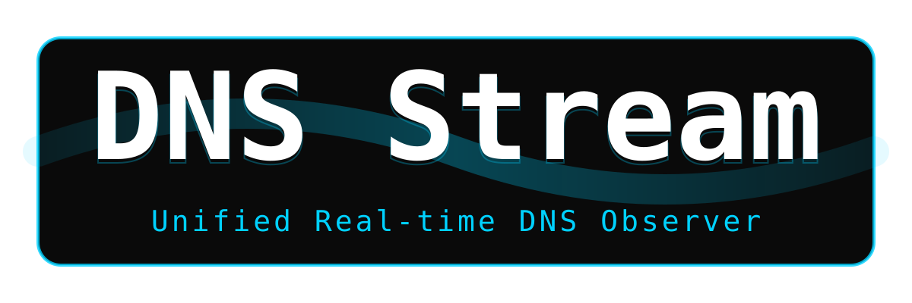

<!--
SPDX-FileCopyrightText: 2026 TSUKUMO Akito <tsukumoakito99@duck.com>
SPDX-License-Identifier: MIT
-->

<p align="center">
  
</p>

# DNS Stream (統合リアルタイムDNSログストリーム & 可視化エンジン)

[English version available here (英語版のREADMEはこちら)](./README.md)

[](https://ziglang.org)
[](LICENSE)

**DNS Stream** は、ハイパフォーマンスなターミナルベースのハイブリッドDNSトラフィック・オブザーバーです。静的なクエリログとリアルタイムなWeb APIの隔たりを解消し、高密度かつセキュアなDNSアクティビティ・ストリームをコンソールに直接提供します。

**Zig 0.16.0** で構築されており、非同期I/Oと独自のネットワークエンジンを活用することで、ブラウザを開くことなく、ネットワークトラフィックの「唯一の真実」をリアルタイムに可視化します。

---

## 💎 3つの柱 (Key Pillars)

### 1. ハイブリッド・オブザベーション・エンジン

従来のログ追跡ツールとは異なり、`DNS Stream` はデュアルフェーズモードで動作します。

- **過去ログの高速回収 (Historical Recovery)**: メモリマッピング (`mmap`) を利用してローカルの `querylog.json` を高速スキャンし、直近の過去イベントを瞬時に復元します。
- **リアルタイム同期 (Real-time Synchronization)**: スライディングウィンドウとハッシュベースの重複排除 (`SeenBuffer`) を用いて AdGuardHome Web API へシームレスに移行し、ジッターのないライブストリームを維持します。

### 2. スナイパー・ネットワーク・エンジン (The Sniper Engine)

複雑なネットワーク環境下でも確実な接続性を保証する、独自のネットワークフック・システムです。

- **TLS Identity Snipe**: DNS解決が不透明な場合でも、TLSハンドシェイク中の証明書からドメイン名をバイナリレベルで直接特定（Snipe）します。
- **プロキシ・マトリクス**: SOCKS5 および HTTP CONNECT トンネルをフルサポート。アイデンティティ・ピニング機能により、中間者攻撃による情報漏洩を防止します。
- **ゼロトラスト検証**: `--network-probe` 診断スイートを使用して、ストリーム開始前に通信経路の正当性を事前検証します。

### 3. セキュア・ヴォルト & カーネル統合

セキュリティは後付けの機能ではありません。`DNS Stream` は資格情報を揮発性の機密情報として扱います。

- **GPG/Pass 連携**: `.password-store` と連携し、GPG暗号化された資格情報をオンデマンドで復号します。
- **Linux Keyring**: 取得した機密情報は、プロセス限定の厳格な権限と共に Linux カーネル・キーリングへ一時的にキャッシュされます。
- **メモリ安全性**: `mlock` および `secureZero` を使用し、パスワードがスワップ領域に漏洩したり、認証後にメモリ内に残存したりすることを防ぎます。

---

## 🛠 必須環境

- **Zig 0.16.0** (`std.Io` および `std.http` の最新機能に依存)
- **GnuPG / GPGME** (セキュアな資格情報管理に必要)
- **scdoc** (任意、man ページの生成に必要)

---

## 🚀 インストール

### 1. Arch Linux & 派生ディストリビューション (AUR)

Arch Linux または Arch ベースのディストリビューション（Manjaro, EndeavourOS 等）を使用している場合、**AUR (Arch User Repository)** を介したインストールが最も確実です：

| パッケージ | バージョン | 説明 | 投票数 | リンク |
| :--- | :--- | :--- | :--- | :--- |
| **dns-stream** |  | 統合リアルタイムDNSログストリーム |  | [](https://aur.archlinux.org/packages/dns-stream) [](./LICENSE) |

AUR ヘルパーを使用したインストール例：

```bash
# yay を使用する場合
yay -S dns-stream

# paru を使用する場合
paru -S dns-stream
```

### 2. ソースからビルド

```bash
make build
sudo make install
```

---

## 📖 ドキュメント

- **Man ページ**: Unix/Linux/macOS ユーザーは、ターミナルネイティブなドキュメントとして `man dns-stream` を参照できます。
- **ローカルマニュアル (ビルド出力)**: `zig build` 実行後、`zig-out/doc/` 内でマニュアルのコピーが利用可能です。これは `man` がない環境（Windows 等）で推奨されます。
- **完全版マニュアル (リポジトリソース)**: Web での閲覧や詳細な仕様の確認：
  - [ユーザマニュアル (英語)](./doc/MANUAL.md)
  - [ユーザマニュアル (日本語)](./doc/MANUAL_ja.md)

---

## ⌨️ 基本的な使用法

デフォルト設定（`/etc/dns-stream/config.json`）を使用して実行：

```bash
dns-stream
```

### セキュア・ヴォルト・モード

GPG 暗号化されたパスワードストアから AdGuardHome のパスワードを取得：

```bash
dns-stream --vault "home/adguard/admin_pass"
```

### 過去ログからの解析

特定の時点からストリームを開始：

```bash
dns-stream --start "2026-01-01T00:00:00"
```

### ネットワーク・マトリクス・プローブ

ストリーム開始前にプロキシと TLS の接続性を検証：

```bash
dns-stream --network-probe --debug
```

---

## 🗺 ロードマップ

`DNS Stream` は、ユニバーサルなDNSオブザーバビリティ・リレーとして進化を続けています。

- [ ] **リモートAPI拡張**: 127.0.0.1 以外の外部 AdGuardHome インスタンスに対する、永続的な認証ハンドシェイクの完全対応。
- [ ] **Pi-hole エコシステム対応**: Pi-hole FTL API の統合および長期データベースのストリーミング対応。
- [ ] **マルチインスタンス・アグリゲーション**: 複数のDNSノードからのストリームを、単一のターミナルビューに統合。
- [ ] **高度なフィルタリング DSL**: 複雑なクエリロジックの実装（例：「サブネットXからのリクエストで、IP Yに解決されたブロック済みのクエリのみ表示」）。

---

## 📜 ライセンス

このプロジェクトは **MIT ライセンス** の下で公開されています。詳細は [LICENSE](LICENSE) ファイルを参照してください。
